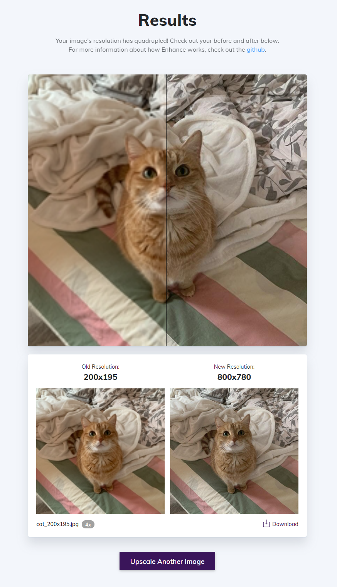

# Enhance

A deep learning image-upscaling model served in a web application.



## How I made it

Data sourcing is done with Twitter's Developer API and twitterscraper web scraping where needed. I conduct Natural Language Processing with the help of `nltk` and `gensim`, using a Multinomial Bayes Model for sentiment analysis and Latent Dirichlet Allocation (LDA) for topic grouping. I convert stock price data and NLP-derved statistics into time-series data and run it through a LSTM to output trading decisions.

I served up my models in a web application through Flask and used Bootstrap to quickly bring my design to reality.

## Run it on your own computer

Make sure you first have Python installed. Install all dependencies and run

```
python app.py
```

## Built With

Deep learning

-   [Tensorflow](https://github.com/tensorflow/tensorflow)
-   [Keras](https://github.com/tensorflow/tensorflow)
-   [NumPy](https://github.com/tensorflow/tensorflow)
-   [DIV2K Dataset](https://github.com/tensorflow/tensorflow)
-   [Microsoft COCO Dataset](https://github.com/tensorflow/tensorflow)

Web

-   [Flask](https://github.com/tensorflow/tensorflow)
-   [Bootstrap](https://github.com/tensorflow/tensorflow)

## License

This project is licensed under the MIT License - see the [LICENSE.md](LICENSE.md) file for details
